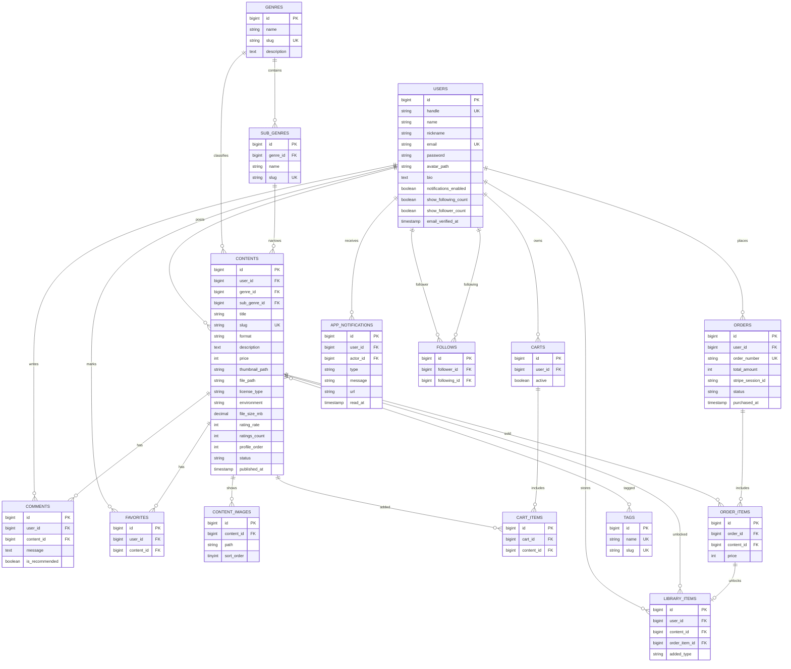

# DigitalAssetPort


DigitalAssetPort は、テンプレート、教材、コード、画像、音声、動画、3Dモデルなどのデジタルデータを販売・配布できるローカル完結型のフリマECサイトです。  
  
2024年頃にLaravelの学習用途でフリマWebアプリを作成したのですが、粗削りな部分もあったため、Laravelの復習も兼ねて0から作り直し、公開できるような形にまで改善しました。

## スクリーンショット
[画面のスクリーンショット一覧はこちら](/ScreanShotTable.md)


## 主な機能

- Laravel Fortify による会員登録、ログイン、ログアウト、メール認証、パスワード再設定
- 日本語バリデーションメッセージ、フォーム属性名の日本語化
- コンテンツ投稿、編集、一覧、詳細、タグ、ジャンル、サブジャンル、表示順、表示件数、詳細検索
- 複数紹介画像、詳細画面ギャラリー、サムネイルクリック、左右ボタンによる画像切り替え
- プロフィールアイコンの正方形クロップ、コンテンツ画像の自由比率クロップ
- お気に入り、コメント、購入者限定レビュー、フォロー、フォロワーリスト、通知
- カート、Stripe Checkout、Stripe未設定時のローカル決済フォールバック
- 購入履歴、購入詳細、ライブラリ、ダウンロード用サンプルレスポンス
- 売上管理、月別売上、日別売上、コンテンツ別売上、注文確認
- アカウント設定、通知表示設定、フォロー数表示設定、アカウント削除
- レスポンシブ対応、Material Symbolsアイコン、ローカルSVGアバター、カスタムページネーション
- Seederによるデモユーザー、コンテンツ、購入、レビュー、通知、お気に入り、フォローの再生成

## ローカルでの本Webアプリの構築・起動
### 前提条件
本Webアプリを構築・起動するには以下が必要です。
- Docker Desktop
- Docker Compose
- WSL2 + Ubuntu（※Windows環境の場合）

### 構築・起動する手順
pullした「DisitalAssetPort」ディレクトリ直下で以下のコマンドを実行することで、ローカルで動くWebアプリが作成・起動されます。
```bash
docker compose up -d --build
docker compose exec php composer install
docker compose exec php php artisan storage:link
docker compose exec php php artisan migrate:fresh --seed
docker compose exec php php artisan key:generate
```
もしもブラウザ(`http://localhost/`)にて権限に関するエラーが表示されていた場合は以下のコマンドを「DisitalAssetPort」ディレクトリ直下で実行してみてください。

```
docker compose exec php chmod -R 777 storage bootstrap/cache
```

## サンプルアカウント

全アカウントのパスワードは `password` です。

| 用途 | メールアドレス |
| --- | --- |
| 管理・動作確認 | `admin@example.com` |
| ビジネス系投稿者 | `office@example.com` |
| 開発教材投稿者 | `code@example.com` |
| 学習教材投稿者 | `study@example.com` |
| 生活系投稿者 | `life@example.com` |
| 製造系投稿者 | `factory@example.com` |
| クリエイティブ投稿者 | `creative@example.com` |

Seeder は既存の会員・コンテンツ系データを削除し、12ユーザー、36コンテンツ、複数紹介画像、購入履歴、レビュー、通知、フォロー、お気に入りを作成します。

## URL一覧

| 画面 | URL |
| --- | --- |
| トップ / コンテンツ一覧 | `http://localhost/` |
| サービス紹介 | `http://localhost/about` |
| 詳細検索 | `http://localhost/search` |
| コンテンツ詳細 | `http://localhost/contents/{slug}` |
| コンテンツ投稿 | `http://localhost/contents/create` |
| ログイン | `http://localhost/login` |
| アカウント登録 | `http://localhost/register` |
| プロフィール編集 | `http://localhost/profile/edit` |
| ユーザープロフィール | `http://localhost/users/{handle}` |
| フォローリスト | `http://localhost/users/{handle}/following` |
| フォロワーリスト | `http://localhost/users/{handle}/followers` |
| お気に入り | `http://localhost/favorites` |
| カート | `http://localhost/cart` |
| ライブラリ | `http://localhost/library` |
| 購入履歴 | `http://localhost/purchases` |
| 売上管理 | `http://localhost/sales` |
| 通知一覧 | `http://localhost/notifications` |
| アカウント設定 | `http://localhost/settings` |
| MailHog | `http://localhost:8025` |
| phpMyAdmin | `http://localhost:8080` |

## 決済

`.env` に `STRIPE_KEY` と `STRIPE_SECRET` を設定すると Stripe Checkout に遷移します。
決済時のカード番号はテスト番号 `4242 4242 4242 4242` を入れて、それ以外は適当に記入し、決済を行うと支払い決済完了となります。

## ディレクトリ構成

```text
.
├── docker/                 # nginx / php / mysql 設定
├── docker-compose.yml
└── src/
    ├── app/                # Models, Controllers, Fortify Actions
    ├── database/           # Migrations, Seeders, Factories
    ├── public/             # 公開CSS/JS、SVGアセット
    ├── resources/          # Blade、CSS/JSソース、lang
    └── routes/web.php
```

## ER図


